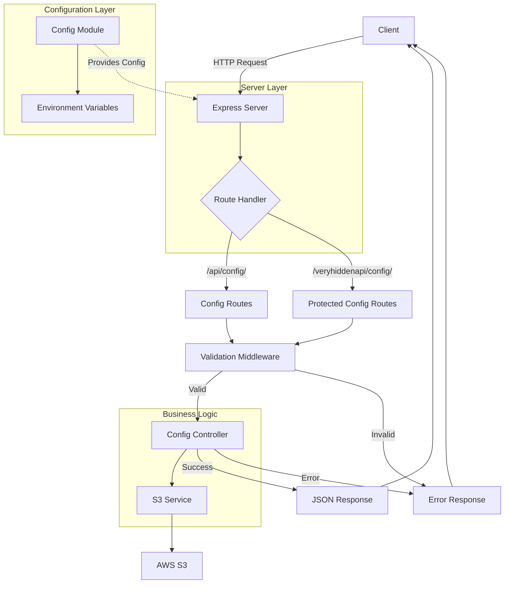
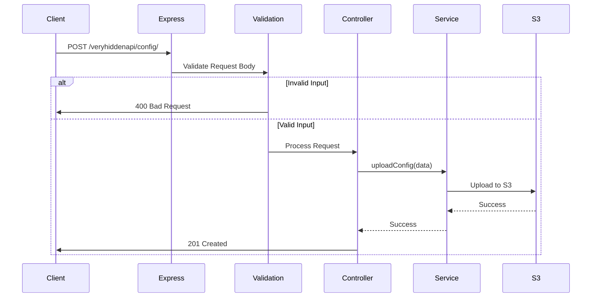

# Modern 2021 Node Api

A modern, production-ready Node.js REST API built with Express.js featuring configuration management, input validation, and comprehensive testing. This project serves as a template and learning resource for building scalable backend services.

Built in 2021. This application demonstrates best practices for building REST APIs with Node.js, including proper error handling, validation, configuration management, and testing.

## Features

- 🚀 Express.js REST API server
- ✅ Input validation using Joi
- 🔧 Environment-based configuration management
- 🧪 Comprehensive test suite with Mocha & Chai
- 📝 ESLint code quality enforcement (Airbnb style)
- 🔄 Hot-reload development with nodemon
- 🏗️ Clean, modular architecture
- 📦 Mock S3 service integration
- 🔒 Validation middleware
- 🌍 Multi-environment support (development, test, production)

### Core Capabilities

- **Express.js REST API**: High-performance web server setup
- **Input Validation**: Joi-powered request body validation
- **Environment Management**: Robust configuration using `config` module
- **Comprehensive Testing**: Full coverage with Mocha and Chai
- **S3 Service Mock**: Integration-ready service architecture

### Technical Excellence

- **Modular Architecture**: Clear separation between routes, controllers, and services
- **Error Handling**: Proper HTTP status codes and structured responses
- **Code Quality**: Strict linting with Airbnb style guide
- **Hot-Reload**: Efficient development workflow with nodemon
- **Documentation**: Self-documenting API structure and Mermaid diagrams

### Developer Experience

- **Easy Setup**: Zero-config development start
- **Testing Framework**: Ready-to-use testing helpers
- **Linting**: Pre-configured ESLint for consistent code style
- **Environment Overrides**: Simple configuration for dev/test/prod
- **Clear Flow**: Visualized request/response flow with Mermaid

## Getting Started

### Prerequisites

- Node.js (v12 or higher)
- npm or pnpm

### Installation

1. Clone the repository:

```bash
git clone https://github.com/orassayag/modern-2021-node-api.git
cd modern-2021-node-api
```

2. Install dependencies:

```bash
npm install
```

3. Start the development server:

```bash
npm run dev
```

The server will start on `http://localhost:4001`

### Configuration

Configuration is managed using the [config](https://www.npmjs.com/package/config) module. Edit configuration files in the `config/` directory:

- `config/default.js` - Default settings
- `config/development.js` - Development overrides
- `config/production.js` - Production overrides
- `config/test.js` - Test environment overrides

**Environment Variables:**

- `PORT` - Server port (default: 4001)
- `HOST` - Server host (default: localhost)
- `AWS_URL` - AWS S3 URL (default: https://s3.amazon.com)
- `NODE_ENV` - Environment: development, test, or production

## Usage

### Development

```bash
npm run dev
```

### Testing

```bash
npm test
```

### Production

```bash
npm start
```

## Available Scripts

### Development Script

Runs the server with automatic reload on file changes:

```bash
npm run dev
```

### Production Script

Runs the server in production mode:

```bash
npm start
```

### Testing Script

Runs the test suite:

```bash
npm test
```

### Linting Script

Checks code quality:

```bash
npm run lint
```

## API Documentation

### GET /api/config/

Retrieves the current configuration.

**Response:**

```json
{
  "a": "value",
  "b": "value"
}
```

**Status:** `200 OK`

### POST /veryhiddenapi/config/

Creates or updates configuration (protected endpoint).

**Request Body:**

```json
{
  "a": "string",
  "b": "string"
}
```

**Status:** `201 Created`

**Validation:** Request body is validated against Joi schema.

## Project Structure

```
modern-2021-node-api/
├── src/
│   ├── index.js                      # Application entry point
│   ├── httpServer/
│   │   ├── index.js                  # Express server setup
│   │   ├── controllers/              # Request handlers
│   │   │   └── configController.js
│   │   ├── middleware/               # Validation middleware
│   │   │   ├── configSchema.js
│   │   │   └── validate.js
│   │   └── routes/                   # API routes
│   │       ├── index.js
│   │       └── configRoutes.js
│   └── services/                     # Business logic services
│       └── s3Service.js
├── config/                           # Environment configuration
│   ├── default.js
│   ├── development.js
│   ├── production.js
│   └── test.js
├── test/                             # Test files
│   ├── helper/
│   │   └── test_helper.js
│   └── controllers/
│       └── config.spec.js
├── .eslintrc.js                      # ESLint configuration
├── package.json
└── README.md
```

## Directory Structure

The project follows a modular structure organized by responsibility:

- **`src/`**: Core application logic
  - **`httpServer/`**: Express server, routes, and controllers
  - **`services/`**: Business logic and external integrations
- **`config/`**: Environment-based configuration files
- **`test/`**: Comprehensive test suite
- **`logs/`**: Application logs (created at runtime)

## Architecture Diagram



## Request Flow



## Development

The project follows modern JavaScript best practices:

- **ES6+ syntax** with async/await
- **Modular architecture** with clear separation of concerns
- **Input validation** using Joi schemas
- **Error handling** with proper HTTP status codes
- **Testing** with Mocha and Chai
- **Code quality** enforced by ESLint (Airbnb configuration)

### Adding New Endpoints

1. Create route definition in `src/httpServer/routes/`
2. Add controller logic in `src/httpServer/controllers/`
3. Create validation schema in `src/httpServer/middleware/`
4. Write tests in `test/controllers/`
5. Register routes in `src/httpServer/routes/index.js`

### Architecture Principles

1. **Separation of Concerns**: Controllers handle requests, services handle logic
2. **Configuration-Driven**: All environment variables and settings managed centrally
3. **Fail-Fast Validation**: Request validation happens at the entry point
4. **Test-First Mentality**: Built-in testing helpers and specs
5. **Standardized Responses**: Consistent JSON response formats

### Design Patterns

- **MVC (Model-View-Controller)**: Simplified for REST API (Controller/Service)
- **Middleware Pattern**: For validation and error handling
- **Singleton Pattern**: For configuration and service instances
- **Dependency Injection**: Simple manual injection in routes

## Testing

The project uses:

- **Mocha** - Test framework
- **Chai** - Assertion library
- **chai-http** - HTTP integration testing

Tests cover:

- API endpoint functionality
- Request validation
- Success and error scenarios
- HTTP status codes

Run tests:

```bash
npm test
```

## Best Practices

1. **Environment Separation**: Always use the correct `NODE_ENV` for your operations
2. **Input Validation**: Define Joi schemas for all new endpoints
3. **Modular Services**: Keep business logic in services, not controllers
4. **Test Coverage**: Write tests for both success and error scenarios
5. **Linting**: Ensure all code passes ESLint before committing

## Contributing

Contributions to this project are [released](https://help.github.com/articles/github-terms-of-service/#6-contributions-under-repository-license) to the public under the [project's open source license](LICENSE).

Everyone is welcome to contribute. Please see [CONTRIBUTING.md](CONTRIBUTING.md) for detailed guidelines.

## Support

For questions, issues, or contributions:

- **GitHub Issues**: [https://github.com/orassayag/modern-2021-node-api/issues](https://github.com/orassayag/modern-2021-node-api/issues)
- **Email**: orassayag@gmail.com

## Author

- **Or Assayag** - _Initial work_ - [orassayag](https://github.com/orassayag)
- Or Assayag <orassayag@gmail.com>
- GitHub: https://github.com/orassayag
- StackOverflow: https://stackoverflow.com/users/4442606/or-assayag?tab=profile
- LinkedIn: https://linkedin.com/in/orassayag

## License

This application has an MIT license - see the [LICENSE](LICENSE) file for details.

## Acknowledgments

- Built for educational and research purposes
- Respects robots.txt and implements rate limiting
- Uses user-agent rotation to avoid detection
- Implements polite crawling practices
